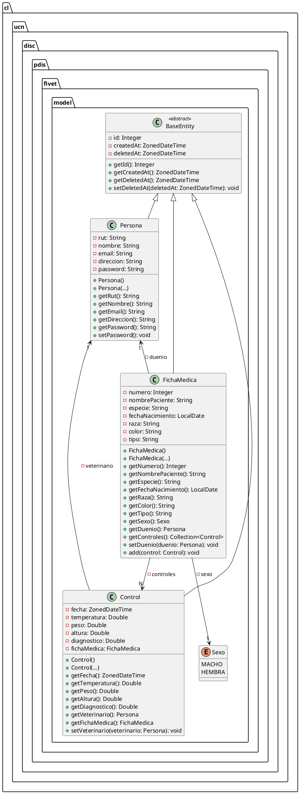
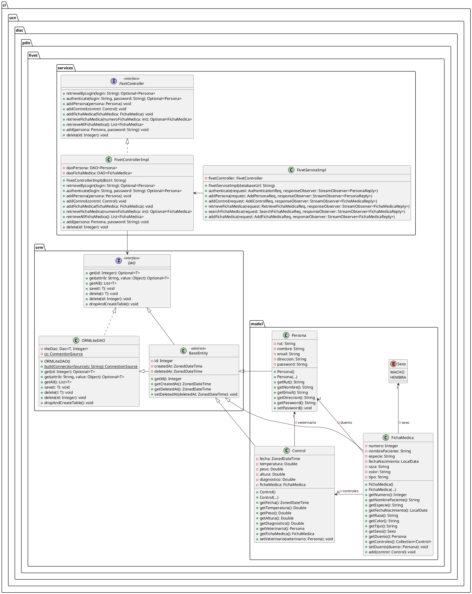

# FiVet

Java Project for "Proyecto Desarrollo e integración de Soluciones".

## Domain Model

```puml
@startuml
package cl.ucn.disc.pdis.fivet.model {
class Control {
-fecha: ZonedDateTime
-temperatura: Double
-peso: Double
-altura: Double
-diagnostico: Double
-fichaMedica: FichaMedica
+Control()
+Control(...)
+getFecha(): ZonedDateTime
+getTemperatura(): Double
+getPeso(): Double
+getAltura(): Double
+getDiagnostico(): Double
+getVeterinario(): Persona
+getFichaMedica(): FichaMedica
+setVeterinario(veterinario: Persona): void
}

class FichaMedica {
    -numero: Integer
    -nombrePaciente: String
    -especie: String
    -fechaNacimiento: LocalDate
    -raza: String
    -color: String
    -tipo: String
    +FichaMedica()
    +FichaMedica(...)
    +getNumero(): Integer
    +getNombrePaciente(): String
    +getEspecie(): String
    +getFechaNacimiento(): LocalDate
    +getRaza(): String
    +getColor(): String
    +getTipo(): String
    +getSexo(): Sexo
    +getDuenio(): Persona
    +getControles(): Collection<Control>
    +setDuenio(duenio: Persona): void
    +add(control: Control): void
}
FichaMedica --> "N" Control : -controles
FichaMedica --> "1" Sexo : -sexo
    
enum Sexo {
    MACHO
    HEMBRA
}

class Persona {
    -rut: String
    -nombre: String
    -email: String
    -direccion: String
    -password: String
    +Persona()
    +Persona(...)
    +getRut(): String
    +getNombre(): String
    +getEmail(): String
    +getDireccion(): String
    +getPassword(): String
    +setPassword(): void
}
Persona "1" <-- FichaMedica : -duenio
Persona "1" <-- Control: -veterinario

class BaseEntity <<abstract>> {
    -id: Integer
    -createdAt: ZonedDateTime 
    -deletedAt: ZonedDateTime
    +getId(): Integer
    +getCreatedAt(): ZonedDateTime
    +getDeletedAt(): ZonedDateTime
    +setDeletedAt(deletedAt: ZonedDateTime): void
}
BaseEntity <|-- Persona
BaseEntity <|-- Control
BaseEntity <|-- FichaMedica
}
@enduml
```

## Class Diagram

```puml
@startuml
package cl.ucn.disc.pdis.fivet {
package model{
class Control {
-fecha: ZonedDateTime
-temperatura: Double
-peso: Double
-altura: Double
-diagnostico: Double
-fichaMedica: FichaMedica
+Control()
+Control(...)
+getFecha(): ZonedDateTime
+getTemperatura(): Double
+getPeso(): Double
+getAltura(): Double
+getDiagnostico(): Double
+getVeterinario(): Persona
+getFichaMedica(): FichaMedica
+setVeterinario(veterinario: Persona): void
}

class FichaMedica {
-numero: Integer
-nombrePaciente: String
-especie: String
-fechaNacimiento: LocalDate
-raza: String
-color: String
-tipo: String
+FichaMedica()
+FichaMedica(...)
+getNumero(): Integer
+getNombrePaciente(): String
+getEspecie(): String
+getFechaNacimiento(): LocalDate
+getRaza(): String
+getColor(): String
+getTipo(): String
+getSexo(): Sexo
+getDuenio(): Persona
+getControles(): Collection<Control>
+setDuenio(duenio: Persona): void
+add(control: Control): void
}
FichaMedica -right-> "N" Control : -controles
FichaMedica -up-> "1" Sexo : -sexo

enum Sexo {
MACHO
HEMBRA
}

class Persona {
-rut: String
-nombre: String
-email: String
-direccion: String
-password: String
+Persona()
+Persona(...)
+getRut(): String
+getNombre(): String
+getEmail(): String
+getDireccion(): String
+getPassword(): String
+setPassword(): void
}
Persona "1" <-down- FichaMedica : -duenio
Persona "1" <-down- Control: -veterinario
}

package orm {
class BaseEntity <<abstract>> {
-id: Integer
-createdAt: ZonedDateTime
-deletedAt: ZonedDateTime
+getId(): Integer
+getCreatedAt(): ZonedDateTime
+getDeletedAt(): ZonedDateTime
+setDeletedAt(deletedAt: ZonedDateTime): void
}
BaseEntity <|-r- Persona
Control -r-|> BaseEntity
BaseEntity <|-d- FichaMedica

interface DAO <<interface>>{
+get(id: Integer): Optional<T>
+get(attrib: String, value: Object): Optional<T>
+getAll(): List<T>
+save(t: T): void
+delete(t: T): void
+delete(id: Integer): void
+dropAndCreateTable(): void
}
DAO <|-- BaseEntity

class ORMLiteDAO {
-theDao: Dao<T, Integer>
{static}-cs: ConnectionSource
+ORMLiteDAO()
{static}+buildConnectionSource(s: String): ConnectionSource
+get(id: Integer): Optional<T>
+get(attrib: String, value: Object): Optional<T>
+getAll(): List<T>
+save(t: T): void
+delete(t: T): void
+delete(id: Integer): void
+dropAndCreateTable(): void
}
ORMLiteDAO <|-r- BaseEntity
ORMLiteDAO .u.|> DAO
}

package services {
interface FivetController <<interface>> {
+retrieveByLogin(login: String): Optional<Persona>
+authenticate(login: String, password: String): Optional<Persona>
+addPersona(persona: Persona): void
+addControl(control: Control): void
+addFichaMedica(fichaMedica: FichaMedica): void
+retrieveFichaMedica(numeroFichaMedica: int): Optional<FichaMedica>
+retrieveAllFichaMedica(): List<FichaMedica>
+add(persona: Persona, password: String): void
+delete(id: Integer): void
}
class FivetControllerImpl {
-daoPersona: DAO<Persona>
-daoFichaMedica: DAO<FichaMedica>
+FivetControllerImpl(dbUrl: String)
+retrieveByLogin(login: String): Optional<Persona>
+authenticate(login: String, password: String): Optional<Persona>
+addPersona(persona: Persona): void
+addControl(control: Control): void
+addFichaMedica(fichaMedica: FichaMedica): void
+retrieveFichaMedica(numeroFichaMedica: int): Optional<FichaMedica>
+retrieveAllFichaMedica(): List<FichaMedica>
+add(persona: Persona, password: String): void
+delete(id: Integer): void
}
class FivetServiceImpl {
-fivetController: FivetController
+FivetServiceImpl(databaseUrl: String)
+authenticate(request: AuthenticationReq, responseObserver: StreamObserver<PersonaReply>)
+addPersona(request: AddPersonaReq, responseObserver: StreamObserver<PersonaReply>)
+addControl(request: AddControlReq, responseObserver: StreamObserver<FichaMedicaReply>)
+retrieveFichaMedica(request: RetrieveFichaMedicaReq, responseObserver: StreamObserver<FichaMedicaReply>)
+searchFichaMedica(request: SearchFichaMedicaReq, responseObserver: StreamObserver<FichaMedicaReply>)
+addFichaMedica(request: AddFichaMedicaReq, responseObserver: StreamObserver<FichaMedicaReply>)
}
FivetController <|.d. FivetControllerImpl
FivetServiceImpl -l-> FivetControllerImpl
}
FivetControllerImpl -d-> DAO
}
@enduml
```

## License
[MIT](https://choosealicense.com/licenses/mit/)
